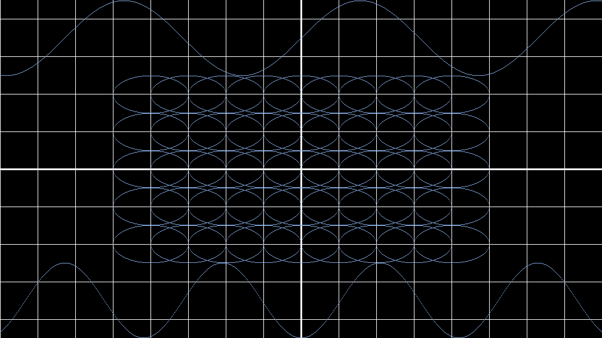
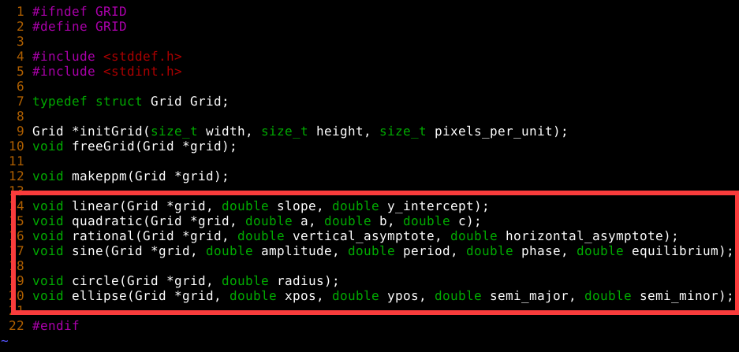

## Pixel Map Function Plotter

Graph any given function within a portable pixel map (.ppm) image



## How to Use

* Set the image properties for the grid at the top of `main()`
* Premade functions can be found toward the bottom half of `grid.h` (red box)



* Call your chosen function in `main()` and define its properties within the arguments
* You can call more than one function for the plot
* Compile the binary `<gcc clang your_compiler> main.c grid.c -lm -o main`
* Run the binary `./main` 
* Now your will have your pixelmap image, the default name is "grid.ppm"

## Build Your Own Function

* You can use the current math functions in `grid.c` as an example
* The general form of a function in this program goes as follows:
```
void template(Grid *grid, <optional parameters for function properties>)
{
	double x, y;
	for (int i = 0; i < grid->width; i++) {
		x = (i - (double)grid->x_origin) / (double)grid->ppu;
		y = < Your function of x here >;
		setcoor(grid, x, y);
	}
}
```
* If your function can have two separate y values for the same value of x 
  (e.g. ellipse, hyperbola), you need to run two loops for each set of values.
  The general form goes as follows:
```
void template(Grid *grid, <optional parameters for function properties>)
{
	double x, y;
	for (int i = 0; i < grid->width; i++) {
		x = (i - (double)grid->x_origin) / (double)grid->ppu;
		y = < function of x >;
		setcoor(grid, x, y);
	}
	for (int i = 0; i < grid->width; i++) {
		x = (i - (double)grid->x_origin) / (double)grid->ppu;
		y = < mirrored function of x  >;
		setcoor(grid, x, y);
	}
}
```
